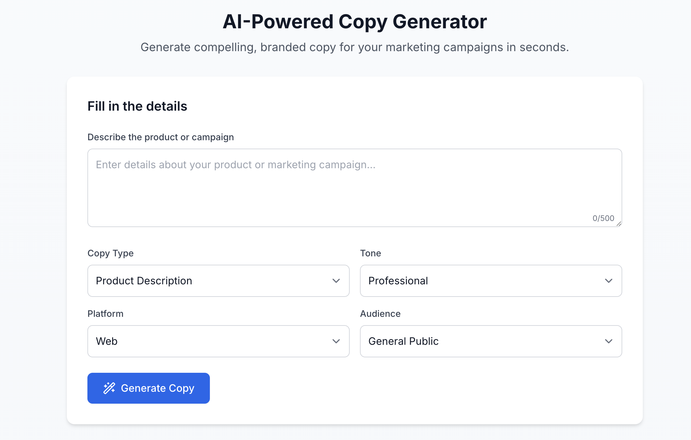
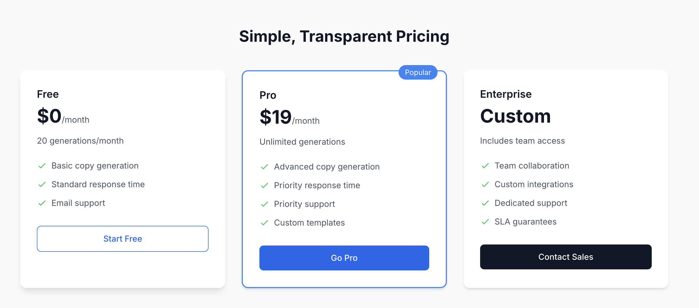

# GhostWritePro – Agency Edition ✍️👻

GhostWritePro is an AI-powered copywriting tool built for digital design and marketing teams.  
It helps teams generate branded, short-form copy like CTAs, product descriptions, microcopy, and headlines — instantly.

---

## 🔗 Live Site
👉 [https://ghostwritepro.netlify.app](https://ghostwritepro.netlify.app)  
👉 [Try the Generator](https://ghostwritepro.netlify.app/#generator)

---

## 📦 Features

- 🔥 AI-powered copy generator using OpenAI GPT-3.5
- 🎛 Form inputs for tone, copy type, audience, and platform
- 🎨 Fully responsive layout built with Tailwind CSS
- 📈 Tiered pricing cards and smooth-scroll navigation
- ⚙️ Built and exported with [Bolt.new](https://bolt.new)

---

## 💻 Tech Stack

- **Frontend:** HTML, Tailwind CSS, TypeScript
- **AI Engine:** OpenAI GPT-3.5 prompt logic
- **Built With:** Bolt.new
- **Deployment:** Netlify

---

## 📸 Screenshots

| Generator UI | Pricing Section |
|--------------|-----------------|
|  |  |

---

## 🧠 About This Project

Built as a portfolio project to showcase UX/UI thinking, prompt design, and frontend integration with AI tools.  
Originally designed for marketing and product teams at companies like Mercor, 1R, NBC Sports Next, and Underdog.

---

## 🧪 Status
✅ Live & Deployed at [https://ghostwritepro.netlify.app](https://ghostwritepro.netlify.app)  
🔜 Future: Save copy results, team accounts, enhanced tone presets

---

## 🙌 Author
**Chris Puncekar** – [@cpuncekar](https://github.com/cpuncekar)
